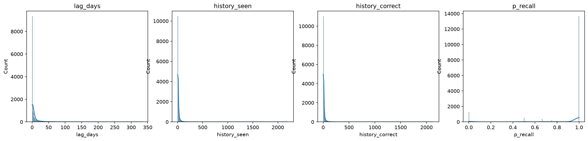
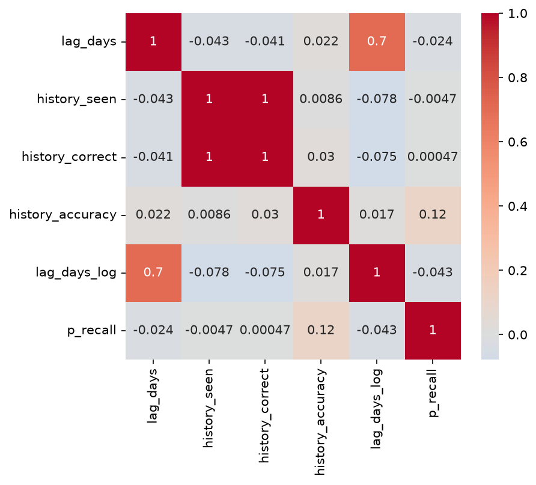

# EDA Report — Duolingo Learning Traces

Dataset is Duolingo's own published half-life regression data. I sampled 2,500 users at the user level (kept every session for each sampled user, didn't just grab random rows), 16,382 sessions total. One row is one user practicing one word at a given time. Target is `p_recall`, the probability they recalled it and it's literally session_correct / session_seen, so those two columns can never be features.

## Distributions

Checked `lag_days`, `history_seen`, `history_correct` and p_recall for shape and outliers, comparing IQR, z-score and modified z-score side by side.

p_recall is clumped hard near 1.0 (75th percentile is already 1.0), which collapses the MAD to zero and breaks modified z-score outright(division by zero). IQR is the only one of the three that actually works here.

history_seen and history_correct are both extremely skewed (skew > 20), but that's not bad data , some users just drill the same word hundreds or thousands of times, most don't. The outlier counts are picking up real behavior, not errors.

lag_days is skewed too but more moderately (6.4). Most sessions happen close together in time, a smaller tail comes back weeks or months later, people forgetting a word and re-practicing it.

## Relationships

Numeric correlations with p_recall are all weak , nothing above `|r| = 0.12` for either Pearson or Spearman (`history_accuracy` is the strongest at 0.116). So recall probably isn't driven by any single feature on its own, more likely some combination, or interactions a tree model would pick up better than a linear correlation would show.

history_accuracy was actually my leakage suspect going in, since it's built from past correctness, but a 0.12 correlation isn't leakage territory, someone's overall accuracy just doesn't predict whether they get *this* word right. Kept it as a feature.

One thing that stood out in the categorical breakdown: `learning_language = "pt"` sits at 0.79 mean recall, other languages are 0.88–0.90, and the group's big enough (n=490) that it's not noise. No idea yet if that's a genuinely harder language or something about who's learning Portuguese on Duolingo. Didn't chase it further, just flagging it.

Nothing here is anywhere near the leakage range from the mini lab (0.99+) , no red flags.

## Leakage audit

Three things I checked for specifically:

**Target leakage.** `p_recall = session_correct / session_seen`, exactly. Both columns are permanently off-limits as features.

**Group leakage.** `user_id` repeats — 2,500 users, 16,382 rows, ~6.5 sessions per user on average. A random split would let the same user show up in both train and test, so the model partly memorizes individuals instead of learning general patterns. That's why the split has to be GroupKFold on user_id, not a plain random KFold.

**Temporal leakage.** Checked and didn't find any. Traced history_seen for one (user, lexeme) pair across its repeated sessions , it only goes up (13, 21, 23, 27, 28, 49), never resets or drops. Consistent with it being built strictly from past sessions.

## Split

Goal is predicting p_recall for a user the model's never seen, not a known user's next session. That's the decision everything else follows from. Went with GroupKFold on `user_id`, no time component. Confirmed on the real data: zero overlapping users across all 5 folds.

15% of users held out as a final test set (375 users, 1,944 rows), untouched until real evaluation. The rest, 2,125 users and 14,438 rows, is the CV pool.

The split is written to `data/split_users.csv` and every later step loads it from there. It used to be re-derived inline in each notebook from `df["user_id"].unique()`, which returns users in row order — so once the SQL join in part 14 reordered the rows, the same seed silently produced a different hold-out set (only 70 of 375 users carried over). Users are now sorted before shuffling, and the file is the single source of truth, so the split no longer depends on which dataset version a notebook happens to read.

## Baseline and metric

On the CV pool: mean baseline gets MAE 0.177, RMSE 0.276, R² 0.0 (which makes sense, R²'s zero point *is* the mean baseline by definition). Median baseline gets MAE 0.106, RMSE 0.295, R² -0.147 wins on MAE because p_recall's median is exactly 1.0 and matches over half the rows outright, but loses on RMSE since it's not built to minimize squared error the way the mean is.

Going with RMSE as the main metric. It punishes big misses a lot harder than small ones, and that fits how this would actually get used - predicting way too high (model thinks they'll remember when they're about to forget) is a real failure, not a rounding error.

Baseline to beat: RMSE 0.276.

One thing I'm parking for later: RMSE and MAE both treat over and under-prediction the same way but the real cost here probably isn't symmetric. Might be worth an asymmetric loss down the line.

## First model

Fit a default `RandomForestRegressor(random_state=42)`, zero tuning, on `lag_days`, `history_seen`, `history_correct`, `history_accuracy`, `lag_days_log`. RMSE came out to 0.155 — clears both dummy baselines by a lot, so there's real signal in these features.

Caveat: this is in-sample, trained and evaluated on the same data, not a real holdout. An unconstrained forest can memorize a chunk of the training set, so 0.155 is probably optimistic. Real CV evaluation is Month 2's job.

All the numbers in this section were recomputed on the saved split. Earlier drafts of this report quoted 0.279 / 0.300 / 0.157, measured on the pre-fix split.
