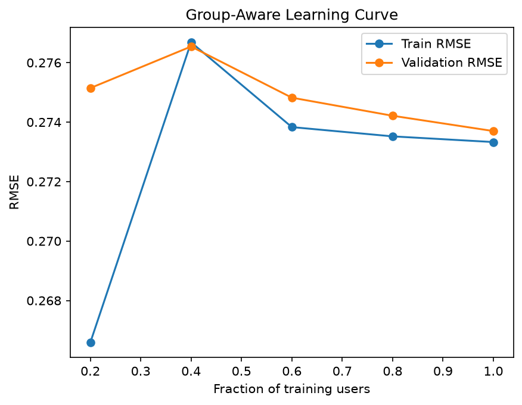

# Month 2 Review — From a Pipeline to an Evaluated Model

Month 1 ended with a tested data pipeline and an in-sample RMSE of 0.155 that did not mean anything, because the model had been scored on the same rows it was trained on. Month 2 was about replacing that number with one that survives contact with unseen users.

The dataset, target and split are unchanged: Duolingo learning traces, `p_recall`, grouped by `user_id`, 2,125 CV users over 14,438 rows, with 375 users and 1,944 rows held out.

## Results

Every score below comes from the same protocol — 5-fold `GroupKFold` on `user_id`, `StandardScaler` inside a `Pipeline` so scaling is fit per training fold, RMSE reported as mean ± fold standard deviation.

| Stage | RMSE |
|---|---|
| Month 1 in-sample signal check | 0.155 (not comparable) |
| Mean baseline | 0.275398 ± 0.010158 |
| LinearRegression | 0.273699 ± 0.009834 |
| Tuned Ridge, `alpha = 30` | 0.273468 ± 0.010290 |
| Tuned Lasso, `alpha = 0.0001` | 0.273533 ± 0.010116 |

The first row is in the table only to be crossed out. It was measured in-sample on an unconstrained random forest, and the real gap between it and honest evaluation is the main lesson of the month.

The rest of the table is narrow. Setting a 0.0017 gap against a 0.010 spread between folds makes it look like nothing, but that comparison throws away the fact that every model was scored on the same folds. Paired per fold, linear regression beats the mean baseline on all five of them:

```text
Fold 1: -0.002610
Fold 2: -0.001608
Fold 3: -0.000827
Fold 4: -0.001900
Fold 5: -0.001549
```

That is a mean difference of -0.001699 with a standard deviation of 0.000576 — small, but consistent in sign and roughly three times its own spread. "Small and real" is a different claim from "lost in noise", and the paired view is the one that distinguishes them. It is a description of five paired measurements, not a significance test.

The same check is not possible for Ridge and Lasso. `GridSearchCV` returned summary statistics and the per-fold scores were not kept, so their margins over ordinary least squares stay uncalled. Storing per-fold scores is a process fix for Month 3.

## What the folds showed

Individual fold RMSEs for linear regression:

```text
Fold 1: 0.284853
Fold 2: 0.273630
Fold 3: 0.263205
Fold 4: 0.262251
Fold 5: 0.284558
```

The spread between the easiest and hardest fold is 0.023, which is more than ten times the gap between the best model and the baseline. Reporting any single split would have been close to meaningless — fold 4 alone would have suggested a much better model than fold 1.

Every fold was checked for user overlap between train and validation. It was zero in all five.

## Bias and variance

The group-aware learning curve was built by holding out validation folds and then training on 20%, 40%, 60%, 80% and 100% of the *users* in each training fold, not on random rows.



| Training users | Train RMSE | Validation RMSE |
|---|---|---|
| 20% | 0.266588 | 0.275145 |
| 40% | 0.276684 | 0.276543 |
| 60% | 0.273833 | 0.274822 |
| 80% | 0.273521 | 0.274214 |
| 100% | 0.273330 | 0.273699 |

At full size the train-validation gap is 0.00037. There is no variance problem to solve. The two curves converge and then flatten, which says that adding more users of the same kind, described by the same five features, will not move the validation score.

The 20% point is the one to be careful with: training error is low there because a small sample is easy to fit, and it rises at 40% before settling. That is sampling noise in a small training subset, not a real trend.

## Regularization

Both Ridge and Lasso were tuned with `GridSearchCV` on the CV pool. Ridge selected `alpha = 30`, Lasso selected `alpha = 0.0001` — the smallest value offered.

Ridge gains 0.00023 over ordinary least squares in mean CV RMSE. Whether that is real cannot be settled from what was recorded — the paired per-fold comparison that worked for baseline against linear regression needs per-fold scores, and `GridSearchCV` only returned summaries. The margin is too small to call in either direction.

The Lasso sweep was more informative than the Ridge one. Pushing alpha up to 0.1 zeroed all five coefficients, and the CV score became 0.275398, matching the mean baseline to six decimal places. A fully sparse linear model *is* a mean baseline, and seeing the two numbers land on top of each other was a better confirmation than any explanation would have been.

On the synthetic side (40 samples, 20 features, only three of them real) the behaviour was much sharper: Lasso at `alpha = 0.2` zeroed 13 of 20 coefficients, kept all three true features at close to full weight, and left four small spurious ones behind. Unregularized least squares spread visible weight across nearly every noise feature. Close to the true support, not exactly it. Regularization does what the textbook says — just not on a five-feature problem with 14,438 rows.

## The assumption that turned out to be wrong

Going in, the working belief was that the model was underperforming because it had not been tuned. Ridge and Lasso were supposed to fix that.

They did not, and the learning curve explains why. The model is not overfitting, so there is no variance for regularization to remove. Tuning was never the bottleneck.

The second belief, formed at the end of Part 11, was that the bottleneck must therefore be representation and model capacity — that a nonlinear model on richer features would open it up. That is the working hypothesis going into Month 3, and it is a hypothesis, not a conclusion. It has not been tested yet.

## Decision log

**Evaluation protocol.** 5-fold `GroupKFold` on `user_id`, chosen because ~6.5 sessions per user makes a row-level split leak. `groups=` is passed explicitly on every call.

**Preprocessing.** `StandardScaler` lives inside the `Pipeline`, never fit on the full CV pool. Fitting it once outside the loop would leak validation-fold statistics into training.

**Primary metric.** RMSE, kept from Month 1. Overpredicting recall — the model saying a word will be remembered when it will not be — is the failure that matters, and squaring the error punishes it harder. Month 1 reported MAE beside it; this month did not, because every comparison here is model against model under one protocol.

**Regularization.** `GridSearchCV` selected Ridge at `alpha = 30` on CV score. The margin over ordinary least squares is well inside fold noise, so carrying Ridge forward is not a performance claim. The argument for preferring a penalised fit at all is the 0.999 collinearity between `history_seen` and `history_correct`, which makes unpenalised coefficients unstable even when predictions are not.

**Holdout.** Untouched. No notebook in `notebooks/month2/` filters on `split == "test"`. It stays closed until a final model is frozen.

## Architecture

Month 1:

```text
raw -> processed -> validated -> features -> model
```

Month 2:

```text
raw
 -> processing
 -> validation
 -> feature pipeline
 -> group-aware CV
 -> regularization and tuning
 -> evaluated model
```

## Where Month 3 starts

The linear family is finished. Train and validation have converged, regularization has nothing to remove, and the gap between the best linear model and the mean baseline — real, but 0.0017 — is the whole return on a month of linear modelling.

That points at trees and ensembles, richer features, and — before any of it — a harder look at how much of the remaining error is reducible at all.
